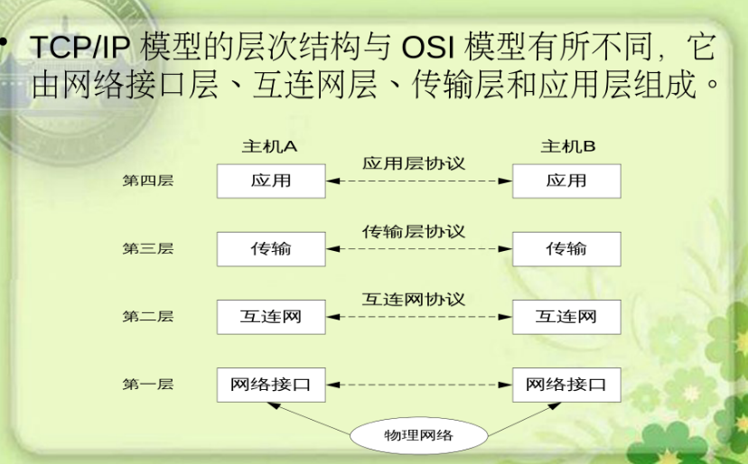
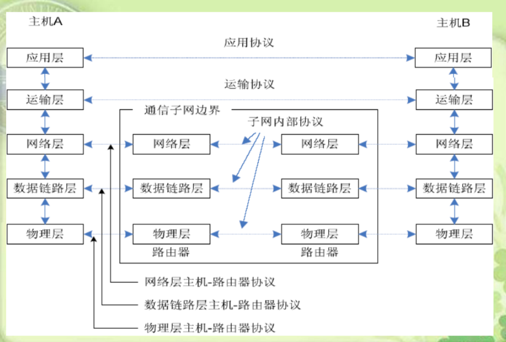
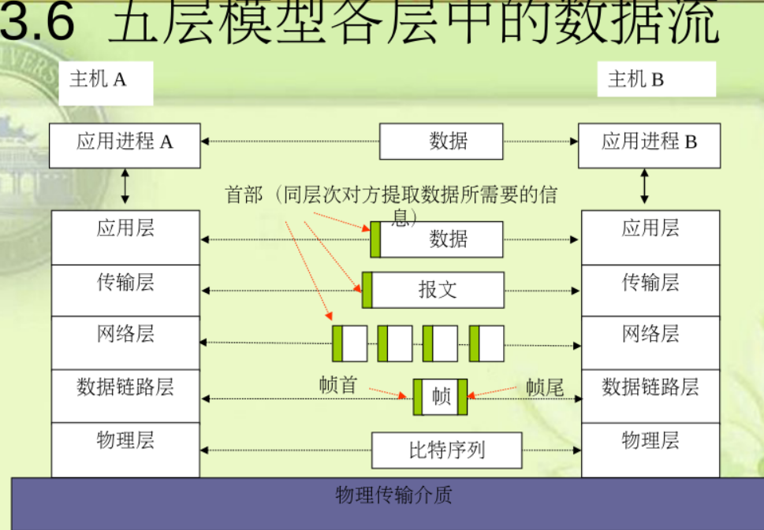

# 计算机网络skeleton
## 概述
* 计算机网络： 将独立的计算机连接起来，实现资源共享
* 计算机网络=资源子网+通信子网，交换机和通信链路构成通信子网，主机H构成资源子网
* 节点、相邻节点、链路（电缆、激光、微波）
* History
    * 出现、ARPANet(一台主机接多个终端)
    * 形成、通信畅通、理论：报文分组交换、层次结构、通信子网与资源子网概念、无法互联
    * 标准化、ISO\OSI模型（ISO提出）、TCP\IP协议规范化（ARPANet提出）
    * 技术不保密,IP地址由32位变成128位
* 性能指标
    * 数据传输率：每秒传输的比特数
    * 带宽：网络最大的数据传输率
    * 吞吐量：单位时间通过网络某一参考截面的数据量
    * 时延： 数据从源端传输到目的端所需要的时间，包括发送、传播、处理、排队时延

* 协议：同层之间的信息传输
* 服务：上下层之间的约定，下层为上层提供接口
* ISO\OSI参考模型太细、太复杂、执行效率低、不实用，未流行起来
* TCP\IP模型层次不分明（允许用户直接调用底层，高效），被广泛应用

* 五层模型——理论模型

* 互联网发展的三个阶段
    * 从单一网络到互联网，H->N
    * 三级结构：主干网<-地区网<-局域网
    * 多层次结构
* C/S、P2P(进程地位相同)
---
## 物理层
